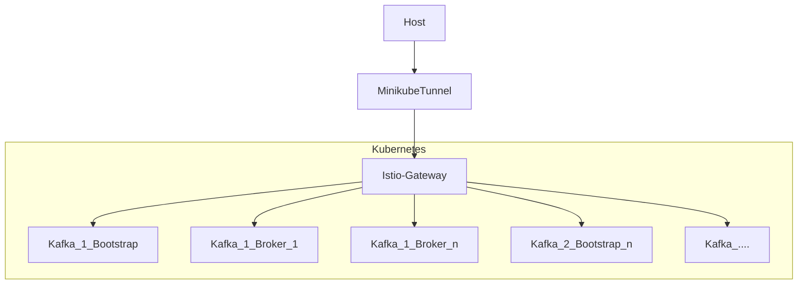

# Strimzi/Kafka with Istio based Ingress

# How's it work?

* The [Gateway API](https://gateway-api.sigs.k8s.io/) resources are configured for SNI based routing (`Gateway`/`TLSRoute`).
* The Kafka CR is configured using TLS listeners of type `cluster-ip`.  These provide 1 kubernetes service per broker and 1 for bootstrap.
* The Strimzi `advertisedHost` feature is used to get Kafka to adveritize broker addresses that are publicly accessible.
* Alongside each Kafka CR we create [TLSRoute](https://gateway-api.sigs.k8s.io/concepts/api-overview/#tlsroute) objects (1 per service) that permit traffic to be ingressed to the bootstrap and broker address(es).  It is the SNI based routing that ensures the traffic reaches the correct kafka cluster and the correct broker within the cluster.
* `/etc/host` file entries are used to create resolvable DNS names for kafka bootstrap and broker(s).




# Prequistes 

1. Install istio locally (I'm using 1.16.2)
2. Clone this repo and `cd` into it

# Prepare cluster

1. Using minikube
1. Install Istio with the Gateway APIs using the instructions below.  These are adapted from [these instructions](https://istio.io/latest/docs/tasks/traffic-management/ingress/gateway-api/):
```
kubectl get crd gateways.gateway.networking.k8s.io || \
  { kubectl kustomize "github.com/kubernetes-sigs/gateway-api/config/crd?ref=v0.5.1" | kubectl apply -f -; }
kubectl apply -f gatewayapi_alphas.yaml
istioctl install --set profile=minimal -y
```  
1. Install strimzi
```
kubectl create namespace kafka
kubectl create -f 'https://strimzi.io/install/latest?namespace=kafka' -n kafka
```

## Create Ingress Gateway

```
kubectl create namespace istio-ingress
kubectl apply -f gateway.yaml
# Await ready
watch kubectl get gateway gateway -n istio-ingress
```

In another terminal start:
```
minikube tunnel
```

Wire up host side name resolution. This will allow the SNI names to resolve locally later.
```
INGRESS=$(kubectl get gateways gateway -n istio-ingress -ojsonpath='{.status.addresses[*].value}')
echo $INGRESS # It will probably look like 10.96.33.216

sudo sh -c 'cat >> /etc/hosts' << EOF
# Kafka/Ingress Gateway experiment
${INGRESS} my-cluster1-kafka-bootstrap.kafka my-cluster1-kafka-0.kafka my-cluster2-kafka-bootstrap.kafka my-cluster2-kafka-0.kafka
EOF
```


## Create First Kafka Instance with its TLSRoutes and start producer/consumer

The important part here is the overridden advertised host in the `my-cluster1-kafka.yaml`.

```
kubectl apply -f my-cluster1-kafka.yaml
kubectl apply -f my-cluster1-tlsroutes.yaml
kubectl wait kafka/my-cluster1 --for=condition=Ready --timeout=300s -n kafka 
kubectl get secrets -n kafka  my-cluster1-cluster-ca-cert -o json | jq -r '.data."ca.crt" | @base64d '  >> /tmp/my-cluster1.crt
```

In separate windows, start publisher/consumer:

```
gtr -dc A-Za-z0-9 </dev/urandom | fold -10 |  kafka-console-producer  -bootstrap-server my-cluster1-kafka-bootstrap.kafka:8090 --topic foo --producer-property security.protocol=SSL --producer-property ssl.truststore.type=PEM --producer-property ssl.truststore.location=/tmp/my-cluster1.crt
```

```
kafka-console-consumer  -bootstrap-server my-cluster1-kafka-bootstrap.kafka:8090 --topic foo -consumer-property security.protocol=SSL --consumer-property ssl.truststore.type=PEM --consumer-property ssl.truststore.location=/tmp/my-cluster1.crt

```

## Create Second Kafka Instance with its TLSRoutes 


```
kubectl apply -f my-cluster2-kafka.yaml
kubectl apply -f my-cluster2-tlsroutes.yaml
kubectl wait kafka/my-cluster2 --for=condition=Ready --timeout=300s -n kafka 
kubectl get secrets -n kafka  my-cluster2-cluster-ca-cert -o json | jq -r '.data."ca.crt" | @base64d '  >> /tmp/my-cluster2.crt


# And show it is working by sending/receiving a message
echo "hello" | kafka-console-producer  -bootstrap-server my-cluster2-kafka-bootstrap.kafka:8090 --topic foo --producer-property security.protocol=SSL --producer-property ssl.truststore.type=PEM --producer-property ssl.truststore.location=/tmp/my-cluster2.crt
kafka-console-consumer  -bootstrap-server my-cluster2-kafka-bootstrap.kafka:8090 --topic foo -consumer-property security.protocol=SSL --consumer-property ssl.truststore.type=PEM --consumer-property ssl.truststore.location=/tmp/my-cluster2.crt --from-beginning

```

Notice that the 1st kafka instance is still happily producing/consumer.


Now delete the 2nd instance

```
kubectl delete -f my-cluster2-kafka.yaml
kubectl delete -f my-cluster2-tlsroutes.yaml
```


Again 1st kafka instance still producing/consuming.

# Useful commands

## Using OpenSSL to verify that the SNI is working

Check that the certificate chain presented belongs to the expected cluster.

```
/usr/local/opt/openssl@3/bin/openssl s_client -connect  my-cluster1-kafka-bootstrap.kafka:8090 -servername my-cluster1-kafka-bootstrap.kafka -showcerts -CAfile /tmp/my-cluster1.crt
```

## Enabling Gateway Debug
 
```
istioctl proxy-config log gateway-5b4469658b-qjgjz.istio-ingress --level debug
```

Istio control plane logging
```
istioctl admin log  --level 'validationController:debug'
```
